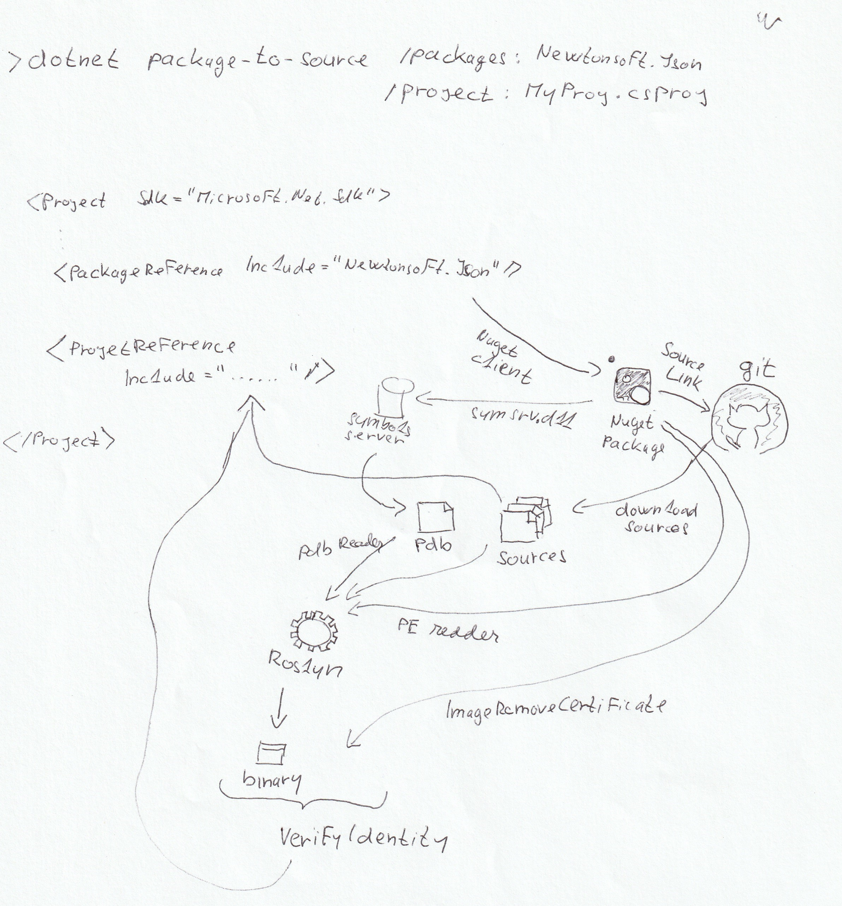
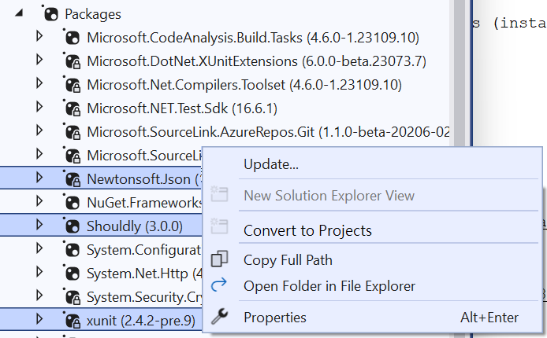

# Packages Sourcing

The feature is meant to simplify the process of fixing, testing and contributing changes in projects published as nugets.

It is inspired by the golang modules design - where a standalone dependency (module) has a pointer to it's source location as a first-class citizen within the ecosystem (go.mod) and the relation between the source codes and runtime dependecy is unambigously guaranteed by the compiler.

The feature is envisioned to be facilitated via [`SourceLink`](https://learn.microsoft.com/en-us/dotnet/standard/library-guidance/sourcelink) repository metadata, [`PE headers`](https://learn.microsoft.com/en-us/dotnet/api/system.reflection.portableexecutable.peheaders?view=net-7.0) and pdb metadata ([`MetadataReader`](https://learn.microsoft.com/en-us/dotnet/api/system.reflection.metadata.metadatareader)), in-memory or persistent switching between `PackageReference` and `ProjectReference` and possibly verification of proper outputs (for `deterministic build` enabled projects).

# User scenarios

## OSS package reference
* Alice is referencing FooBar nuget in her project and she is using automated PRs to consume the latest available version
* A new version of FooBar nuget is published, automated PR into Alice project is created to update the `PackageReference` and the PR is failing
* Alice is investigating the issue and suspecting problem in FooBar library. If the package was properly SourceLink-ed and symbols published, Alice can debug into the code and diagnose the issue
* Alice would like to try to fix the issue, test the fix and contribute back to the OSS. She can achieve this with `Packages Sourcing` feature

## Internal corp package flows
* Bob is working in Contoso co. Contoso co. has dozens of internal repositories and internal package feed used to publish and consume the artifacts of individual repositories
* Bob is working on component that is consuming another component - BarBaz - as a nuget package.
* Bob wants to contribute an improvement to component BarBaz, that would be leveraged by his component. He wants to first test the improvement with his component before contributing back to the BarBaz. He can achieve this with `Packages Sourcing` feature

## (Out of scope) Source as package reference
* Bob from previous scenario needs to work on couple of components that interact with each other and which reference themselves via `PackageReference`s.
* To simplify his work, Bob wants to include locations with components source code as reference locations for resolving `PackageReference`s, while he'd expect the build to properly interpret the components sources as packages (provided those can be successfuly build and packed)
* Alteration of this sceanrio is referencing a reference via git repo link and commit hash (analogously to go modules).

## (Out of scope) package references or general binary materials integrity and provenance report
* Alice from the first scenario wants to verify the FooBar package integrity and OSS repo origin.
* Alice wants to run summary report on a deployment bundle that would list signatures, sources origin and identity of reconstructive build for all verifiable binaries in her deployment bundle.
* Tailored installable `dotnet` tool is capable to run such checks.
  ```cmd
  > dotnet tool install Microsoft.Build.BuildIntegrity
  > dotnet check-package-integrity FooBar.Baz 6.5.4-beta1

  Signature: OK (FooBar)
  Sources: github.com/FooBar/Baz@0abcb66
  Build Integrity: OK (deterministic, reconstructed localy)

  > dotnet check-build-integrity \\build\share\v-1.0.0 *

  Signatures summary:
   5  Binaries unsigned
   12 Binaries valid signature
   2  Binaries invalid signature

  Build integrity summary:
   7  Binaries binaries unsupported for verification
   1  Binary unverifiable (nondeterministic build)
   11 Binaries with verified build integrity

  Detailed report: check-build-integrity-report.htm
  ```

# Scope

## In scope
* API/CLI for initiating the `Package Sourcing` for particular nuget(s) (sdk?). API for flipping the `PackageReference` (msbuild?)
* Flip to interactive reference and patching should survive between builds on a single machine 

## Out of scope
 * **Patching the package/binary dependencies in a deployable way**. The interaction is ment to be used only on developer machine and not survive beyond repository push, external environment deployment etc.
 * **Survival of patches accross `PackageReference` updates**.
 * **Supporting nuget packages that are not `SourceLink` enabled**. As a fallback we might use `SourceLink` stamped symbols, but unless the `SourceLink` information is to be found either within the nuget package or published matching symbols, this feature will not be enabled.
 * **Custom pre-build prerequisities**. First version of the feature will assume existence of the project file with matching name (or `AssemblyName`) within the linked repository and it's possibility to build with `dotnet build`.

# Design proposal



 ## Subproblems

 * Opting-in mechanism - to request switch to local sources
 * Preserving the info about swtich to local sources
 * Opting-out mechanism - to switch back to regular package reference
 * Local storage of sources - submodule vs standalone checkout
 * Indication mechanism informing the user about usage of local sources (especially in case where local patch is applied)
 * Locating and fetching proper source codes
 * Infering the proper 'build recipe' for the binary and verifying the result (in case of determinictic build)
 * Verifying that the locally build package is correct - leveraging deterministic build; signature stripping etc.
 * Allowing to quickly consume local code patches (via edit and continue/ hot reload mechanism)

 Some of those problems might be eliminated by simplifying the workflow and e.g. providing a command that prepares a project and edits the original MSBuild file to replace `PackageReference` with `ProjectReference` - the consuming of code patches and indicating the altered reference to user would not be needed.
 
 ## Possible Implementations

 Following sections discuss possible implementations of individual [subproblems outlined above](#subproblems).

 ### Opting-in

 For simplified and isolated rollout of this feature we propose CLI-only interface (no VS or other tooling integration):

```cmd
> dotnet tool install Microsoft.Build.PackageSourcing
> dotnet package-to-sources --project MySolution.sln --packages: FooBar.Baz, Newtonsoft.Json

FooBar.Baz:
Sources located: github.com/FooBar/Baz@0abcb66
Local checkout: C:\Users\jankrivanek\.nuget\sources\FooBar\6.5.4\
Build recipe created: FooBar-package-sourcing.proj
Build reconstructed: OK
Reference replaced: OK

Newtonsoft.Json:
...

Sourced packages are ready to use.

>
```

This as well solves the question of preserving the info about packages sourcing.

### Opting-out

This can be achieved via adding a metadata to mofdified MSBuild files, storing the info about original `PackageReference`s and then reverting those via another CLI command:

```cmd
> dotnet package-to-sources --revert --project MySolution.sln --packages: FooBar.Baz, Newtonsoft.Json

Successfuly reverted packages sourcing for: FooBar.Baz, Newtonsoft.Json.
>
```

### Local storage of sources

To be decided (nuget cache? Submodules of the current git context? ...)

 ### Locating proper sources
 * Most preferable way is via `SourceLink` metadata within the nuget package itself ([documentation](https://learn.microsoft.com/en-us/dotnet/standard/library-guidance/sourcelink), [reading the metadata](https://learn.microsoft.com/en-us/nuget/reference/nuget-client-sdk#get-package-metadata))
 * Fallback to `SourceLink` metadata within symbol files ([documentation](https://learn.microsoft.com/en-us/cpp/build/reference/sourcelink?view=msvc-170), [Portable PDB format spec](https://github.com/dotnet/runtime/blob/main/docs/design/specs/PortablePdb-Metadata.md), [reading source locations metadata](https://github.com/dotnet/runtime/blob/main/src/libraries/System.Reflection.Metadata/tests/Metadata/PortablePdb/DocumentNameTests.cs))
 * We should consider ability to specify/pass-in a custom location of sources - this would facilitate portion of the 'Source as package reference' scenario (possibly something that might be usable for our 'source build' or 'VMR build').

 ### Infering the 'build recipe'
 This is the most challenging part of the story - as .NET ecosystem currently doesn't enforce custom build pre-requisities standards nor conventions and hence it is not possible to replicate the package build process without possible manual steps. This part will hence be 'best efforts' with sensible communication of issues to user. 
 
 We envision multiple options to achieve this goal (with possibility of fallback/combination of multiple approaches):
 * Option A: Using Pdb info/ Roslyn to extract information from PE/Pdbs and reconstruct the compilation ([roslyn experimental code](https://github.com/dotnet/roslyn/blob/main/src/Tools/BuildValidator/Program.cs#L268), [NugetPackageExplorer SymbolValidator](https://github.com/NuGetPackageExplorer/NuGetPackageExplorer/blob/main/Core/SymbolValidation/SymbolValidator.cs#L145)). Access to symbol files (whether published as .snupkg on nuget.org or on microsoft or corporate symbols servers) is crucial for this method. As well as usage of particualr compiler toolchain used to generate the inspected package (**TBD** - what minimal version do we need for .NET (?[5.0.3 or MSBuild 16.10](https://github.com/NuGetPackageExplorer/NuGetPackageExplorer/commit/a272c8c314257dfa99c6befd2cfeff39b8a6ecbe), what we need for .NET Framework (if supporrted at all)?)
 * Option B: Sources crawling and finding project by name/assembly name; build; compare results
 * Option C: Working backwards from the nuget (finding pack script or msbuild properties indicating nuget creation ...); build; compare results
 * Option D: Seting up convention for explicit description of build prerequisites and package build. Inspiration for this can be `.proj` files describing external dependencies build recipe in dotnet source build ([sample build descriptions](https://github.com/dotnet/source-build-externals/tree/main/repos))

**_Extensive research needed for this subproblem._**

 ### Verifying identity of local package with the feed one

 In case deterministic build was opted-out, this would be very challenging and nearly impossible - so not supported.
 For signed assemblies we'll need to strip signatures ([`ImageRemoveCertificate`](https://learn.microsoft.com/en-us/windows/win32/api/imagehlp/nf-imagehlp-imageremovecertificate)). Removing signature might nullify checksum bytes in PE header - so binary comparison to the locally built assembly might not match (solution is to temporarily remove the PE header checksum from the local binary as well - to facilitate binary equality).

 ### Allowing to quickly consume local code patches

 To be decided.
 But likely this will be no-op for the initial version - standard usage scenarios for project references will kick in.

 # Security considerations

 [Under construction]
 * The build verification mode (out of scope) needs proper design of handling of symbols embedded files and pointers to any sources outside of expected repository root. (otherwise intruder with access to the production build can infect not only the binary, but the symbol file as well)
 * MIM for the symbol server (offering crafted symbol file with pointers to custom sources that can allow execution of intruder code on the developer machine)
 * Possible licensing considerations - there can be packages with different redistribution requirements for packages and originating sources, but allowing user to switch from package reference to source references we are technically making it easier for the user to miss and fail license agreement.

 # Cross team dependencies considerations

 * **Nuget - No dependency** - the proposal doesn't evision changes to the nuget client nor server contracts
 * **Visual Studio, Project System - No dependency in initial version** - the proposal envision exposing functionality via CLI (and API) only, after the whole concept is constructed and alive, we should start reaching out to those teams to consider exposing the functionality via GUI - e.g.:
 
 * **SDK - No dependency** - the initial version would be delivered as standalone (optional) dotnet tool
 * **Roslyn - Consultation and engineering** - ideally packing and exporting the [BuildValidator](https://github.com/dotnet/roslyn/tree/main/src/Tools/BuildValidator) and mainly [Rebuild](https://github.com/dotnet/roslyn/tree/main/src/Compilers/Core/Rebuild). MSBuild team should fund this effort
 * **MSBuild - Likely no dependency** - There migh need to be some support for allowing storing info about link between original PackageReference and injected ProjectReference - however current MSBuild constructs should suffice here.

 There can be possible leverage of the work by other teams:
 * Nuget - [NugetPackageExplorrer](https://github.com/NuGetPackageExplorer/NuGetPackageExplorer) - as it currently heavily uses custom code to extract information from PE/Pdb metadata.
 * Source Build / VMR - to validate buildability of 3rd party components and low touch process of enlisting new 3rd party dependencies into source build